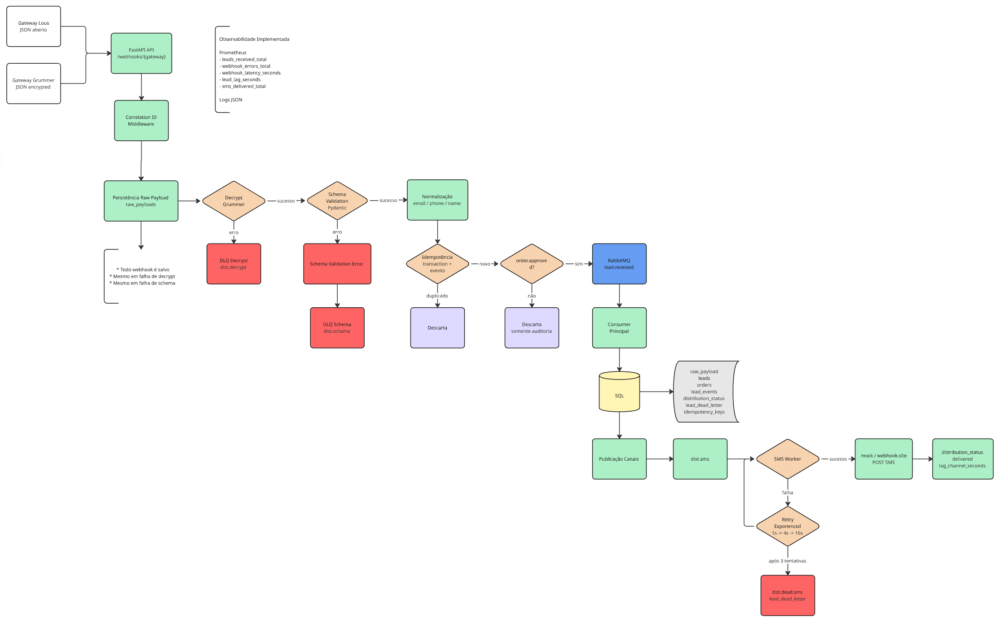
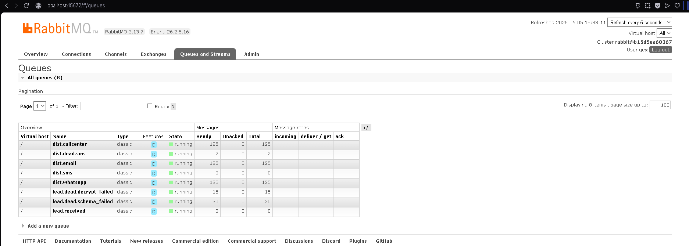
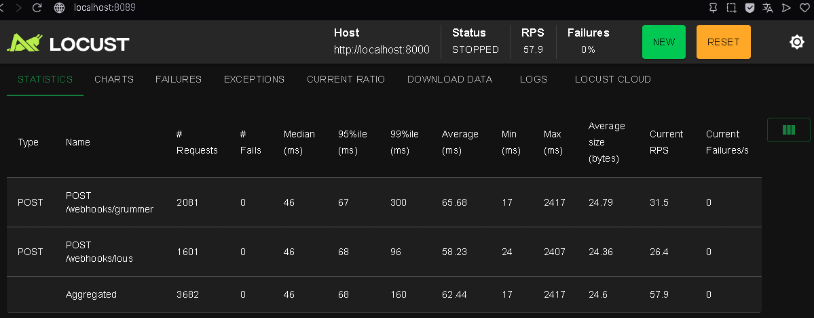

# gexTest

## Visão Geral

Teste técnico backend desenvolvido com **FastAPI**, **RabbitMQ**, **MySQL**, **Prometheus** e processamento assíncrono orientado a eventos.

O sistema recebe webhooks de gateways externos, realiza validações, normalizações, controle de idempotência, persistência para auditoria, distribuição assíncrona via RabbitMQ e monitoramento através de métricas Prometheus.

---

# Diagrama de Fluxo



---

# Tecnologias Utilizadas

- Python 3.12
- FastAPI
- RabbitMQ
- MySQL
- Docker
- Docker Compose
- Prometheus
- Pydantic
- aio-pika
- aiohttp
- AsyncIO
- Structured Logging
- Locust

---

# Fluxo da Aplicação

```text
Gateway
→ API FastAPI
→ Correlation ID
→ Persistência Raw Payload
→ Decrypt (Grummer)
→ Schema Validation
→ Normalização
→ Idempotência
→ RabbitMQ
→ Consumer
→ Persistência SQL
→ Distribuição SMS
→ Retry Exponencial
→ DLQ
```

## Regras Implementadas

### Persistência obrigatória

Todo webhook recebido é salvo em:

```text
raw_payloads
```

Mesmo quando ocorrer:

- erro de decrypt
- erro de schema
- erro interno

### Decrypt

Gateway Grummer:

```text
AES-256-CBC
PKCS7
```

### Schema Validation

Realizada utilizando Pydantic.

Payload inválido:

```text
lead.dead.schema_failed
```

### Normalização

Email:

```text
trim
lowercase
```

Telefone:

```text
remoção de caracteres inválidos
```

Nome:

```text
remoção de espaços duplicados
```

### Idempotência

Chave natural:

```text
(transaction_id, event)
```

### Eventos válidos

Somente:

```text
event = order.approved
payment.status = approved
```

seguem para processamento.

---

# Estrutura do Projeto

```text
app/
├── controller/
│   └── receiver.py
├── rabbit/
│   ├── connection.py
│   └── publisher.py
├── services/
│   ├── decrypt.py
│   ├── dlq_service.py
│   ├── idempotency.py
│   ├── lead_service.py
│   ├── normalizer.py
│   └── raw_payload_service.py
├── workers/
│   ├── consumer.py
│   ├── consumer_runner.py
│   ├── distributor.py
│   └── distributor_runner.py
├── config.py
├── database.py
├── logging_config.py
├── main.py
├── metrics.py
├── middleware.py
└── schemas.py

sql/
├── 001_create_tables.sql
├── 002_indexes.sql
├── 003_stored_procedure.sql
└── audit_queries.sql

tests/
├── locustfile.py
├── send_webhooks_threadpool.py
└── webhook_payloads.json
```

---

# Organização da Arquitetura

## Controller

Recebe requisições HTTP e inicia o fluxo.

Arquivo:

```text
app/controller/receiver.py
```

## Services

Regras de negócio.

Responsável por:

- decrypt
- normalização
- idempotência
- persistência
- auditoria
- DLQ

## Rabbit

Responsável por:

- conexão RabbitMQ
- publicação de mensagens
- desacoplamento

## Workers

Responsável por:

- consumo de filas
- persistência
- distribuição SMS
- retries
- DLQ

## Database

Responsável por:

- pool de conexões
- transações
- acesso ao MySQL

## Middleware

Responsável por:

```text
Correlation ID
```

## Observabilidade

Responsável por:

- Prometheus
- Logs JSON
- Correlation ID

## Schemas

Responsável por:

- validação Pydantic
- contratos de entrada

---

# Principais Arquivos

## receiver.py

Fluxo principal:

```text
Webhook
→ Persistência
→ Decrypt
→ Schema
→ Normalização
→ Idempotência
→ RabbitMQ
```

## consumer.py

Consome:

```text
lead.received
```

Responsável por:

- criar lead
- criar order
- criar lead_event
- criar distribution_status

## distributor.py

Implementação do canal SMS.

Fluxo:

```text
dist.sms
→ mock SMS endpoint
→ retry
→ atualização distribution_status
→ DLQ
```

## send_webhooks_threadpool.py

Dispara os 200 payloads do desafio utilizando ThreadPoolExecutor.

Permite validar:

- concorrência
- throughput
- idempotência

Execução:

```bash
python tests/send_webhooks_threadpool.py
```

## locustfile.py

Teste de carga.

Execução:

```bash
locust -f tests/locustfile.py --users 20 --spawn-rate 5
```
Parâmetros utilizados:

- Users: 20
- Spawn Rate: 5 usuários/segundo

Interface:

```text
http://localhost:8089
```

## audit_queries.sql

Consultas exigidas pelo desafio:

- lag médio
- pending
- taxa de sucesso SMS
- DLQ
- reconciliação

## 001_create_tables.sql

Criação das tabelas:

```text
raw_payloads
webhook_idempotency
leads
orders
lead_events
distribution_status
lead_dead_letter
```

## 002_indexes.sql

Índices para otimização das auditorias.

Validados com:

```sql
EXPLAIN
```

## 003_stored_procedure.sql

Persistência transacional de:

```text
Lead
Order
Lead Event
Distribution Status
```

## prometheus.yml

Configuração do Prometheus.

## docker-compose.yml

Infraestrutura completa:

```text
MySQL
RabbitMQ
API
Consumer
SMS Worker
Prometheus
```

---

# Subindo o Projeto

## Configuração com .env.example

O projeto já possui um arquivo `.env.example` pronto para execução local.

Criar o arquivo `.env`:

```bash
cp .env.example .env
```

O projeto já vem configurado para utilizar o mock interno de SMS:

```env
SMS_WEBHOOK_URL="http://api:8000/mock/sms"
```

Opcionalmente pode ser utilizado um endpoint externo:

```env
# SMS_WEBHOOK_URL="https://sms-api.free.beeceptor.com"
```

### Simulação de Falhas SMS

Requisito do desafio:

```env
SMS_FAILURE_RATE=0.10
```

Representa:

```text
10% de falha aleatória
```

Para validar Retry + DLQ:

```env
SMS_FAILURE_RATE=1.00
```

Representa:

```text
100% de falha
```

Permitindo validar:

- Retry exponencial
- dist.dead.sms
- lead_dead_letter

## Build

```bash
docker compose up -d --build
```

## Containers

```bash
docker ps
```

## Derrubar Ambiente

```bash
docker compose down
```

## Resetar Banco

```bash
docker compose down -v
docker compose up -d
```

---

# RabbitMQ

Painel:

```text
http://localhost:15672
```

Usuário:

```text
gex
```

Senha:

```text
gex12345
```

## Evidência



O RabbitMQ foi utilizado como broker de mensageria para desacoplar a API dos workers assíncronos.

Filas criadas:

```text
lead.received

dist.sms
dist.email
dist.callcenter
dist.whatsapp

dist.dead.sms

lead.dead.decrypt_failed
lead.dead.schema_failed
```

Interpretação do estado apresentado:

### lead.received

Fila principal consumida pelo worker responsável por persistir:

```text
leads
orders
lead_events
distribution_status
```

### dist.sms

Fila consumida pelo distribuidor SMS.

Quando vazia significa que todas as mensagens já foram processadas.

### lead.dead.decrypt_failed

Mensagens que falharam na descriptografia do gateway Grummer.

### lead.dead.schema_failed

Mensagens que falharam na validação de schema.

### dist.dead.sms

Mensagens que falharam definitivamente após:

```text
1s
4s
16s
```

e foram enviadas para DLQ.

### dist.email
### dist.callcenter
### dist.whatsapp

Filas modeladas conforme arquitetura.

Apenas SMS foi implementado conforme solicitado no desafio.

---

# Prometheus

Acesso:

```text
http://localhost:9090
```

## Evidência


Consulta executada:

```promql
sum by (gateway) (leads_received_total)
```

Exemplo de resultado:

```text
grummer = 71
lous = 54
Total = 125
```

Total:

```text
125
```

O valor representa a quantidade de leads válidos, aprovados e únicos aceitos para processamento.

A soma coincide com o volume esperado descrito no arquivo:

```text
expected_summary_meta.json
```

## Métricas Implementadas

### leads_received_total

Quantidade de leads válidos aprovados recebidos pela aplicação.

Labels:

```text
gateway
event
```

### webhook_errors_total

Quantidade de erros durante o processamento.

Labels:

```text
gateway
error_type
```

Exemplos:

```text
decrypt_failed
schema_validation_failed
```

### webhook_latency_seconds

Latência total da requisição de webhook.

Permite acompanhar:

```text
tempo médio
percentis
performance geral
```

### lead_lag_seconds

Tempo entre:

```text
transaction_time do gateway
```

e

```text
processamento interno da aplicação
```

Permite medir atraso de processamento.

### sms_delivered_total

Quantidade de SMS entregues ou falhados.

Labels:

```text
delivered
failed
```

---

# Testes de Carga (Locust)

Execução:

```bash
locust -f tests/locustfile.py
```

Interface:

```text
http://localhost:8089
```

## Evidência



O Locust foi utilizado para validar o comportamento da API sob carga concorrente.

Resultado apresentado:

```text
3682 requisições
0 falhas HTTP
57.9 requests/segundo
```

Distribuição:

```text
2081 requisições → /webhooks/grummer
1601 requisições → /webhooks/lous
```

## Interpretação das métricas

### Requests

Quantidade total de requisições executadas.

### Fails

Quantidade de falhas HTTP.

No teste executado:

```text
0 falhas
```

### Median

Tempo mediano de resposta.

### 95%ile

Tempo abaixo do qual 95% das requisições foram concluídas.

### 99%ile

Tempo abaixo do qual 99% das requisições foram concluídas.

### Average

Tempo médio de resposta.

### RPS

Requests Per Second.

Quantidade de requisições processadas por segundo.

No teste apresentado:

```text
57.9 RPS
```

Essas métricas permitem avaliar:

- throughput
- concorrência
- estabilidade
- latência
- capacidade de processamento da API

---

## Evidências de Auditoria SQL

Os outputs das queries de auditoria e seus respectivos planos de execução (`EXPLAIN`) estão disponíveis em:

```text
evidence_database/audit_queries/

---

# Distribuidor SMS

Fluxo:

```text
dist.sms
→ mock SMS endpoint
→ delivered
```

Falha:

```text
dist.sms
→ retry 1s
→ retry 4s
→ retry 16s
→ dist.dead.sms
```

Após a terceira falha a mensagem é enviada para:

```text
lead_dead_letter
dist.dead.sms
```

---

# Observabilidade

## Logs JSON

Todos os logs incluem:

```text
correlation_id
gateway
event
latency_ms
```

Permitindo rastreabilidade ponta a ponta.

## Prometheus

Métricas implementadas:

```text
leads_received_total
webhook_errors_total
webhook_latency_seconds
lead_lag_seconds
sms_delivered_total
```

---

# Testes

## ThreadPool

```bash
python tests/send_webhooks_threadpool.py
```

Executa os 200 payloads fornecidos pelo desafio.

## Locust

```bash
locust -f tests/locustfile.py
```

Interface:

```text
http://localhost:8089
```

Permite validar:

- concorrência
- latência
- throughput
- estabilidade

---

# Queries de Auditoria

Disponíveis em:

```text
sql/audit_queries.sql
```

Incluem:

- Lag médio por gateway
- Leads presos em pending
- Taxa de sucesso SMS
- Erros em DLQ
- Reconciliação approved x delivered

---

# Resultado Esperado

Arquivo:

```text
expected_summary_meta.json
```

Distribuição esperada:

```text
125 approved válidos únicos
15 decrypt failures
20 schema failures
20 duplicados
20 descartados
```

---

# Resultado Obtido

Após execução dos 200 payloads fornecidos:

```text
125 leads válidos e únicos
15 falhas de decrypt
20 falhas de schema
20 duplicados
20 descartados
```

Os resultados podem ser visualizados executando:

```bash
python tests/send_webhooks_threadpool.py
```

Resultados compatíveis com o arquivo:

```text
expected_summary_meta.json
```

## Validação dos 125 Leads Únicos

Embora o teste concorrente exiba um resumo da execução, a fonte oficial para validação dos registros persistidos é o banco de dados.

A consulta abaixo comprova a quantidade de leads aprovados, válidos e únicos processados pela aplicação:

```sql
SELECT
    COUNT(DISTINCT CONCAT(o.transaction_id, '|', le.event))
        AS approved_unique
FROM lead_events le
JOIN orders o
    ON o.id = le.order_id
WHERE le.event = 'order.approved';
```

Resultado esperado:

```text
approved_unique = 125
```

Também é possível visualizar a distribuição por dia:

```sql
SELECT
    DATE(le.persisted_at) AS day_ref,
    COUNT(DISTINCT le.id) AS approved_unique
FROM lead_events le
WHERE le.event = 'order.approved'
GROUP BY DATE(le.persisted_at);
```

## Observação

O resumo exibido pelo `send_webhooks_threadpool.py` representa apenas os retornos HTTP recebidos durante a execução concorrente.

A confirmação definitiva dos dados processados deve ser realizada através das consultas de auditoria no banco de dados, garantindo que os registros foram efetivamente persistidos e processados pela esteira assíncrona.

---

# Melhorias Futuras

- OpenTelemetry para tracing distribuído
- Jaeger para visualização de traces
- Dashboards Grafana
- Implementação dos canais Email, WhatsApp e Call Center

---

## Autor

Desenvolvido por **Deryck Henrique Albuquerque**
