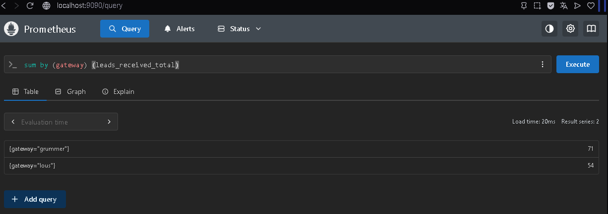

# WebhookFlow


## Visão Geral

WebhookFlow é uma plataforma de processamento de webhooks orientada a eventos, desenvolvida com **FastAPI**, **RabbitMQ**, **MySQL** e **Prometheus**.

O projeto simula uma esteira completa de integração, validação, auditoria, processamento assíncrono e distribuição de eventos, utilizando práticas comuns em sistemas de integração de médio e grande porte.

A solução foi construída com foco em:

- Processamento assíncrono
- Idempotência
- Dead Letter Queues (DLQ)
- Observabilidade
- Auditoria
- Escalabilidade

---

## Versão Atual

```text
v1.0.0
```

---

# Arquitetura


---

# Tecnologias Utilizadas

- Python 3.12
- FastAPI
- RabbitMQ
- MySQL
- Docker
- Docker Compose
- Prometheus
- Pydantic
- aio-pika
- aiohttp
- AsyncIO
- Structured Logging
- Locust

---

# Funcionalidades

- Recepção de webhooks
- Decrypt AES-256-CBC
- Validação de schema
- Normalização de dados
- Idempotência
- Processamento assíncrono
- RabbitMQ
- Retry exponencial
- Dead Letter Queues (DLQ)
- Logs estruturados
- Correlation ID
- Métricas Prometheus
- Auditorias SQL
- Testes de carga com Locust

---

# Fluxo da Aplicação

```text
Gateway
→ API FastAPI
→ Correlation ID
→ Persistência Raw Payload
→ Decrypt (Grummer)
→ Schema Validation
→ Normalização
→ Idempotência
→ RabbitMQ
→ Consumer
→ Persistência SQL
→ Distribuição SMS
→ Retry Exponencial
→ DLQ
```

## Regras Implementadas

### Persistência obrigatória

Todo webhook recebido é salvo em:

```text
raw_payloads
```

Mesmo quando ocorrer:

- erro de decrypt
- erro de schema
- erro interno

### Decrypt

Gateway Grummer:

```text
AES-256-CBC
PKCS7
```

### Schema Validation

Realizada utilizando Pydantic.

Payload inválido:

```text
lead.dead.schema_failed
```

### Normalização

Email:

```text
trim
lowercase
```

Telefone:

```text
remoção de caracteres inválidos
```

Nome:

```text
remoção de espaços duplicados
```

### Idempotência

Chave natural:

```text
(transaction_id, event)
```

### Eventos válidos

Somente:

```text
event = order.approved
payment.status = approved
```

seguem para processamento.

---

# Estrutura do Projeto

```text
app/
├── controllers/
│   └── receiver.py
├── messaging/
│   ├── connection.py
│   └── publisher.py
├── services/
│   ├── decrypt.py
│   ├── dlq_service.py
│   ├── idempotency.py
│   ├── lead_service.py
│   ├── normalizer.py
│   └── raw_payload_service.py
├── workers/
│   ├── consumer.py
│   ├── consumer_runner.py
│   ├── distributor.py
│   └── distributor_runner.py
├── config.py
├── database.py
├── logging_config.py
├── main.py
├── metrics.py
├── middleware.py
└── schemas.py

sql/
├── 001_create_tables.sql
├── 002_indexes.sql
├── 003_stored_procedure.sql
└── audit_queries.sql

tests/
├── locustfile.py
├── send_webhooks_threadpool.py
└── test_webhooks.json
```

---

# Organização da Arquitetura

## Controllers

Recebe requisições HTTP e inicia o fluxo.

Arquivo:

```text
app/controllers/receiver.py
```

## Services

Regras de negócio.

Responsável por:

- decrypt
- normalização
- idempotência
- persistência
- auditoria
- DLQ

## Messaging

Responsável por:

- conexão RabbitMQ
- publicação de mensagens
- desacoplamento

## Workers

Responsável por:

- consumo de filas
- persistência
- distribuição SMS
- retries
- DLQ

## Database

Responsável por:

- pool de conexões
- transações
- acesso ao MySQL

## Middleware

Responsável por:

```text
Correlation ID
```

## Observabilidade

Responsável por:

- Prometheus
- Logs JSON
- Correlation ID

## Schemas

Responsável por:

- validação Pydantic
- contratos de entrada

---

# Principais Arquivos

## receiver.py

Fluxo principal:

```text
Webhook
→ Persistência
→ Decrypt
→ Schema
→ Normalização
→ Idempotência
→ RabbitMQ
```

## consumer.py

Consome:

```text
lead.received
```

Responsável por:

- criar lead
- criar order
- criar lead_event
- criar distribution_status

## distributor.py

Implementação do canal SMS.

Fluxo:

```text
dist.sms
→ mock SMS endpoint
→ retry
→ atualização distribution_status
→ DLQ
```

## send_webhooks_threadpool.py

Dispara múltiplos payloads utilizando ThreadPoolExecutor.

Permite validar:

- concorrência
- throughput
- idempotência

Execução:

```bash
python tests/send_webhooks_threadpool.py
```

## locustfile.py

Teste de carga.

Execução:

```bash
locust -f tests/locustfile.py --users 20 --spawn-rate 5
```
Parâmetros utilizados:

- Users: 20
- Spawn Rate: 5 usuários/segundo

Interface:

```text
http://localhost:8089
```

## audit_queries.sql

Consultas:

- lag médio
- pending
- taxa de sucesso SMS
- DLQ
- reconciliação

## 001_create_tables.sql

Criação das tabelas:

```text
raw_payloads
webhook_idempotency
leads
orders
lead_events
distribution_status
lead_dead_letter
```

## 002_indexes.sql

Índices para otimização das auditorias.

Validados com:

```sql
EXPLAIN
```

## 003_stored_procedure.sql

Persistência transacional de:

```text
Lead
Order
Lead Event
Distribution Status
```

## prometheus.yml

Configuração do Prometheus.

## docker-compose.yml

Infraestrutura completa:

```text
MySQL
RabbitMQ
API
Consumer
SMS Worker
Prometheus
```

---

# Subindo o Projeto

## Configuração com .env.example

O projeto já possui um arquivo `.env.example` pronto para execução local.

Criar o arquivo `.env`:

```bash
cp .env.example .env
```

O projeto já vem configurado para utilizar o mock interno de SMS:

```env
SMS_WEBHOOK_URL="http://api:8000/mock/sms"
```

Opcionalmente pode ser utilizado um endpoint externo:

```env
# SMS_WEBHOOK_URL="https://sms-api.free.beeceptor.com"
```

### Simulação de Falhas SMS

Requisito:

```env
SMS_FAILURE_RATE=0.10
```

Representa:

```text
10% de falha aleatória
```

Para validar Retry + DLQ:

```env
SMS_FAILURE_RATE=1.00
```

Representa:

```text
100% de falha
```

Permitindo validar:

- Retry exponencial
- dist.dead.sms
- lead_dead_letter

## Build

```bash
docker compose up -d --build
```

## Containers

```bash
docker ps
```

## Derrubar Ambiente

```bash
docker compose down
```

## Resetar Banco

```bash
docker compose down -v
docker compose up -d
```

---

# RabbitMQ

Painel:

```text
http://localhost:15672
```

## Evidência


O RabbitMQ foi utilizado como broker de mensageria para desacoplar a API dos workers assíncronos.

Filas criadas:

```text
lead.received

dist.sms
dist.email
dist.callcenter
dist.whatsapp

dist.dead.sms

lead.dead.decrypt_failed
lead.dead.schema_failed
```

O canal SMS foi implementado como referência para demonstrar o fluxo completo de distribuição assíncrona. A arquitetura foi preparada para suportar novos canais utilizando o mesmo padrão de publicação e consumo de mensagens.

Interpretação do estado apresentado:

### lead.received

Fila principal consumida pelo worker responsável por persistir:

```text
leads
orders
lead_events
distribution_status
```

### dist.sms

Fila consumida pelo distribuidor SMS.

Quando vazia significa que todas as mensagens já foram processadas.

### lead.dead.decrypt_failed

Mensagens que falharam na descriptografia do gateway Grummer.

### lead.dead.schema_failed

Mensagens que falharam na validação de schema.

### dist.dead.sms

Mensagens que falharam definitivamente após:

```text
1s
4s
16s
```

e foram enviadas para DLQ.

### dist.email
### dist.callcenter
### dist.whatsapp

Filas modeladas conforme arquitetura.

---

# Prometheus

Acesso:

```text
http://localhost:9090
```

## Evidência



Consulta executada:

```promql
sum by (gateway) (leads_received_total)
```

A consulta demonstra a distribuição de eventos processados por gateway, permitindo acompanhar o volume de mensagens aceitas pela plataforma.

Os valores variam conforme os dados processados pela aplicação.

# Métricas Implementadas

### leads_received_total

Quantidade de leads válidos aprovados recebidos pela aplicação.

Labels:

```text
gateway
event
```

### webhook_errors_total

Quantidade de erros durante o processamento.

Labels:

```text
gateway
error_type
```

Exemplos:

```text
decrypt_failed
schema_validation_failed
```

### webhook_latency_seconds

Latência total da requisição de webhook.

Permite acompanhar:

```text
tempo médio
percentis
performance geral
```

### lead_lag_seconds

Tempo entre:

```text
transaction_time do gateway
```

e

```text
processamento interno da aplicação
```

Permite medir atraso de processamento.

### sms_delivered_total

Quantidade de SMS entregues ou falhados.

Labels:

```text
delivered
failed
```

---

# Testes de Carga (Locust)

Execução:

```bash
locust -f tests/locustfile.py --users 20 --spawn-rate 5
```

Interface:

```text
http://localhost:8089
```

## Evidência


O Locust foi utilizado para validar o comportamento da API sob carga concorrente.

Exemplo de execução:

- milhares de requisições processadas
- nenhuma falha HTTP
- throughput estável

Essas métricas permitem avaliar:

- throughput
- concorrência
- estabilidade
- latência
- capacidade de processamento da API

---

# Distribuidor SMS

Fluxo:

```text
dist.sms
→ mock SMS endpoint
→ delivered
```

Falha:

```text
dist.sms
→ retry 1s
→ retry 4s
→ retry 16s
→ dist.dead.sms
```

Após a terceira falha a mensagem é enviada para:

```text
lead_dead_letter
dist.dead.sms
```

---

# Observabilidade

## Logs JSON

Todos os logs incluem:

```text
correlation_id
gateway
event
latency_ms
```

Permitindo rastreabilidade ponta a ponta.

## Prometheus

Métricas implementadas:

```text
leads_received_total
webhook_errors_total
webhook_latency_seconds
lead_lag_seconds
sms_delivered_total
```

---

# Testes

## ThreadPool

```bash
python tests/send_webhooks_threadpool.py
```

Executa múltiplos webhooks de forma concorrente utilizando ThreadPoolExecutor, permitindo validar concorrência, throughput e comportamento da idempotência sob carga.

## Locust

```bash
locust -f tests/locustfile.py
```

Interface:

```text
http://localhost:8089
```

Permite validar:

- concorrência
- latência
- throughput
- estabilidade

---

# Queries de Auditoria

Disponíveis em:

```text
sql/audit_queries.sql
```

Incluem:

- Lag médio por gateway
- Leads presos em pending
- Taxa de sucesso SMS
- Erros em DLQ
- Reconciliação approved x delivered

---

# Cenários de Validação

Durante os testes foram simulados diferentes cenários operacionais para validar o comportamento da plataforma:

- Eventos válidos
- Eventos duplicados
- Falhas de descriptografia
- Falhas de validação de schema
- Falhas de distribuição SMS
- Processamento concorrente

Esses cenários permitiram validar:

- Idempotência
- Retry exponencial
- Dead Letter Queues
- Persistência transacional
- Observabilidade
- Processamento assíncrono

---

# Melhorias Futuras

## Roadmap

### v1.1.0
- Dashboards Grafana
- Alertas operacionais

### v1.2.0
- Reprocessamento de DLQ
- Painel administrativo

### v1.3.0
- OpenTelemetry
- Jaeger

### v2.0.0
- Canais Email
- WhatsApp
- Call Center

### v2.1.0
- Circuit Breaker para provedores externos
- Rate Limiting

---

# Autor

Desenvolvido por **Deryck Henrique Albuquerque**

Backend Developer | Python | FastAPI | RabbitMQ | Docker | AWS
